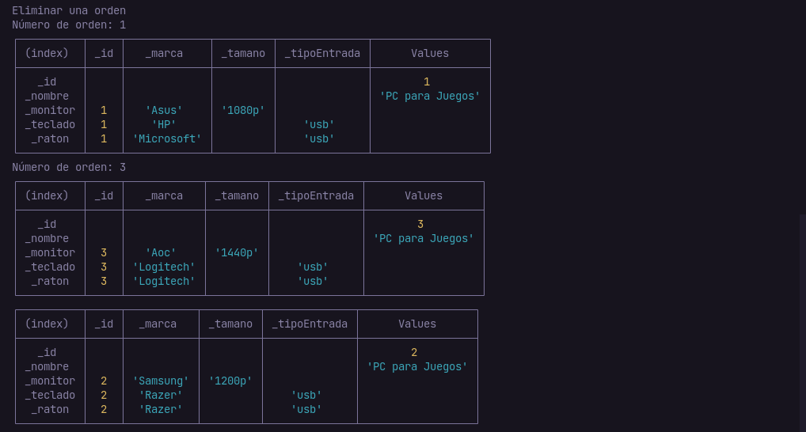

# Actividades día 1
## Actividad de promesas

- Crear una promesa por cada endpoint. 
- Ejecutar todas las promesa de forma:
- asincrona
- promise.all
- promise.race  
* https://flagcdn.com/es/codes.json
* https://jsonplaceholder.typicode.com/posts
* https://jsonplaceholder.typicode.com/posts/2

```javascript
const https = require("https");

function fetch(url) {
  return new Promise((resolve, reject) => {
    https
      .get(url, (resp) => {
        let data = "";
        resp.on("data", (chunk) => {
          data += chunk;
        });
        resp.on("end", () => {
          resolve(JSON.parse(data));
        });
      })
      .on("error", (error) => {
        reject(error);
      });
  });
}

const URL_BANDERAS = "https://flagcdn.com/es/codes.json";
const URL_POSTS = "https://jsonplaceholder.typicode.com/posts";
const URL_POST = (id) => `${URL_POSTS}/${id}`;

const obtenerCodigos = fetch(URL_BANDERAS);
const obtenerPosts = fetch(URL_POSTS);
const obtenerPost = fetch(URL_POST(2));

let promesas = [obtenerCodigos, obtenerPost, obtenerPosts];
// Hacer las petitiones para todas
obtenerCodigos.then((json) => {
  console.table(Object.keys(json));
});

obtenerPosts.then((posts) => {
  console.log(posts);
});

obtenerPost.then((post) => {
  console.log(post);
});

//Promise.all
Promise.all(promesas).then((resultados) => {
  console.log(resultados);
});

//Promise.race
Promise.race(promesas).then((resultado) => {
  console.log(resultado);
});

```
## Actividad POO


##### Versión de node: `v16.15.1`
##### Estructura
```
├── entity
│   ├── Computadora.js
│   ├── Data.js
│   ├── DispositivoEntrada.js
│   ├── Inventory.js
│   ├── Monitor.js
│   └── Orden.js
├── data.json
├── index.js
└── package.json
```
##### Funcionamiento




##### Estructura del JSON
```json
{
  "descripcion": "Ordenes",
  "ordenes": []
}
```
- Ejemplo
```json
{
  "descripcion": "Ordenes",
  "ordenes": [
    {
      "_computadoras": [
        {
          "_id": 1,
          "_nombre": "PC para Juegos",
          "_monitor": {
            "_id": 1,
            "_marca": "Asus",
            "_tamano": "1080p"
          },
          "_teclado": {
            "_marca": "HP",
            "_id": 1,
            "_tipoEntrada": "usb"
          },
          "_raton": {
            "_marca": "Microsoft",
            "_id": 1,
            "_tipoEntrada": "usb"
          }
        }
      ],
      "_id": 1
    },   
  ]
}

```